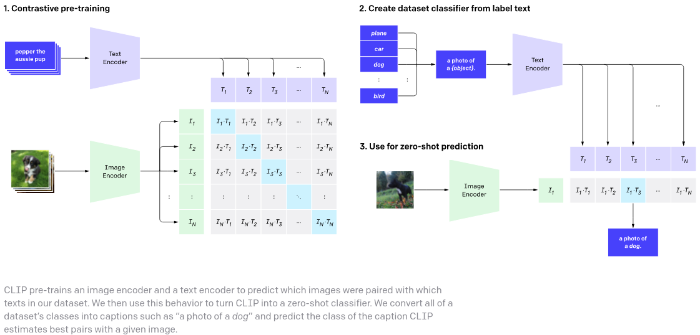

## CLIP &mdash; Simple TensorFlow Implementation [[Link]](https://openai.com/blog/clip/)

<div align="center">
  
</div>

## Usage

```python
import tensorflow as tf
from clip import CLIP

clip_model = CLIP(
    dim_text = 512,
    dim_image = 512,
    dim_latent = 512,
    num_text_tokens = 10000,
    text_enc_depth = 6,
    text_seq_len = 256,
    text_heads = 8,
    visual_enc_depth = 6,
    visual_image_size = 256,
    visual_patch_size = 32,
    visual_heads = 8,
)

# mock data
text = tf.random.uniform([4, 256], minval=0, maxval=10000, dtype=tf.int32)
images = tf.random.normal([4, 256, 256, 3])

# train
loss = clip_model(
    text,
    images,
    freeze_image_encoder = False,   # whether to freeze image encoder if using a pretrained image net, proposed by LiT paper
    return_loss = True              # needs to be set to True to return contrastive loss
)
```

## Reference
* [x-clip](https://github.com/lucidrains/x-clip)

## Author
* [Junho Kim](http://bit.ly/jhkim_resume)
